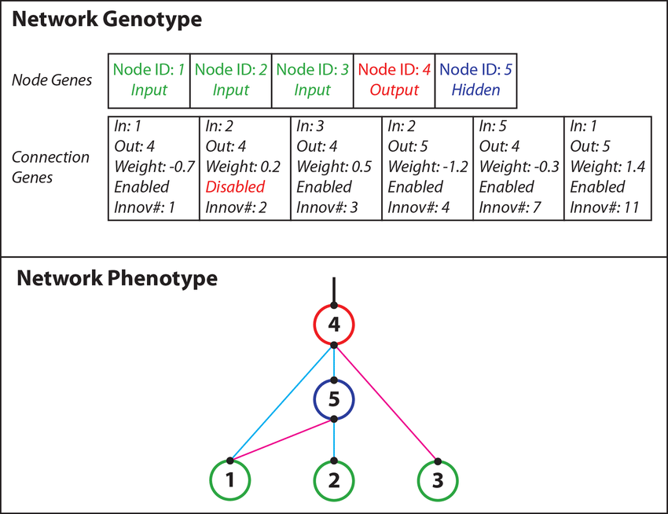
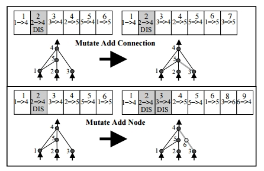
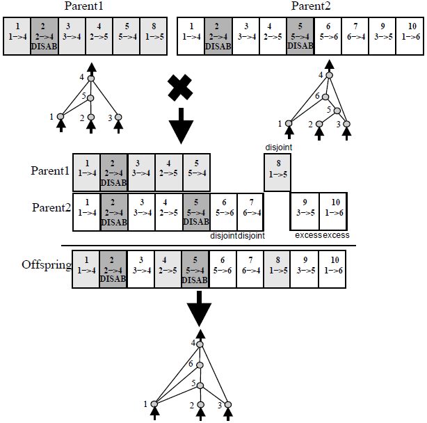
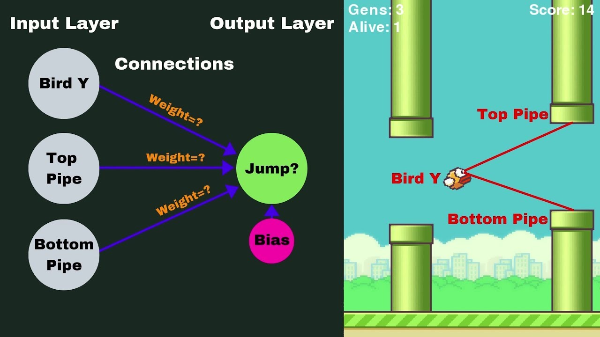

# NEAT Solution
In this project, I apllied a genetic algorithm called **NEAT (NeuroEvolution of Augmenting Topologies)**, in order to find an efficient neural network who can play flappy bird.

This project was adapted and based on a previous project by [TechWithTim](https://techwithtim.net).

## Contents
 - **[What's NEAT](#whats-neat)**
    - [Genotypes And Phenotypes](#genotypes-and-phenotypes)
    - [Mutations](#mutations)
    - [Crossovers](#crossovers)
 - **[How It Adapts To The Game](#how-it-adapts-to-the-game)**
    - [Fitness Function](#fitness-function)
    - [Inputs and outputs](#inputs-and-outputs)
 - **[How To Run](#how-to-run)**
 
 ## What's NEAT
**NeuroEvolution of Augmenting Topologies (NEAT)** was first presented in [this paper](http://nn.cs.utexas.edu/downloads/papers/stanley.cec02.pdf), realeased in 2002 by Kenneth O. Stanley and Risto Miikkulainen.
 
 The paper discribes a genetic algorithm which can be used to generate Artificial Neural Networks, which, at the time, outperformed state-of-the-art reinforcement learning techniques.
 
 One good benefit ot NEAT is that it normally creates a lighter and more efficient neural network than if we used a fixed-topology net instead.

### Genotypes And Phenotypes
NEAT works by creating by creating a set of neural networks. Each network has a **Genotype**, that is, a set of node genes and connection genes.

Node genes just indicate what type of neuron it is: if it is a **input** neuron, an **hidden** neuron or a **output** neuron.

Connection genes, on the other hand, offer more information:
 - The starting neuron
 - The ending neuron
 - The weight on the connection
 - if the connection is enabled or not
 - The innovation number (which will be explained later)

The manifestation of the genes, that is, the resulting network, is called the **Phenotype**

### Mutations
As with other genetic algorithms, NEAT has a mutation factor, that is, random mutations can be applied to the networks.

Two types of mutations can occur in NEAT:
 - New connections
 - New nodes

 

When any new mutation occurs, the resulting connection gene is given an **innovation number**. 

This number is not relative to each network, it is, instead, a **global number** that signifies a mutation. This way, if the same mutation occurs in two different nets, it won't result in two different innovation numbers and the same mutation won't be treated as two different mutations.

But *why* do we use innovation numbers?

### Crossovers

Another fundamental aspect of genetic algoriths is the crossover of the best performing genotypes of previous generations. 

When performing crossover in NEAT, the offspring inherits the genes from both parents. Disjoint and excess genes, genes that appear in one net but not on the other, are also inherited, resulting in a new network. 

The innovation numbers of the resulting network is kept the same because, even tough the created network is new, none of its connections and nodes are new.

## How It Adapts To The Game
What has been explained until now is general NEAT information that refers to the algorithm and is the same for every project. Now it's time to discuss some practices who change from project to project. 
### Inputs And Outputs
The *config-feedforward.txt* file is the backbone of the NEAT. It defines a variety of parameters, such as the number of networks we spawn in each generation, the activation functions to be used, the mutation rates, etc.

Two parameters that are never mutated during the training process are **the number of input and output neurons**. It's very obvious why we wouldn't want this numbers to change as  these are the neurons which interact directly with game, that is, the neurons who recieve and send information to the game.

In this project, there are 3 input neurons, they are:
 - Bird y position
 - Bird distance to the top pipe
 - Bird distance to the bottom pipe 
 
The output neuron will be a value between -1 and 1 (due to tanh activation function), if the output value is > 0.5, the bird will jump.

The diagram below shows the initial network without the hidden neurons (source: TechWithTim): 

### Fitness Function
 In order to classify the networks in terms of their performance, we have to create a custom **fitness function**, that is, a function which, for each generation, tells us who were the best performing networks.
 
In the context of flappy bird, the fitness function is defined by the distance and the number of pipes the bird has transversed.
 
In each generation, a number of birds (defined in the *config-feedforward.txt* file by the parameter *pop-size*) is spawned. The best performing birds/genomes are then bred and mutated resulting in a new generation.

After a bird achieves a score of 20 pipes passed, the training ends as it is very probable it already achieved the optimal solution and won't die.

## How To Run

This project uses **pygame**, **numpy** and **neat-python**, so be sure to install these libraries before trying to run it.

**best.pickle** contains the best performing network, so when you run **flappy_bird.py** it will load the network and play the game by itself. 

If you want to watch the training process, just delete best.pickle and run the python file. As stated before, as soon as one bird is able to pass 20 pipes, the training ends.

 